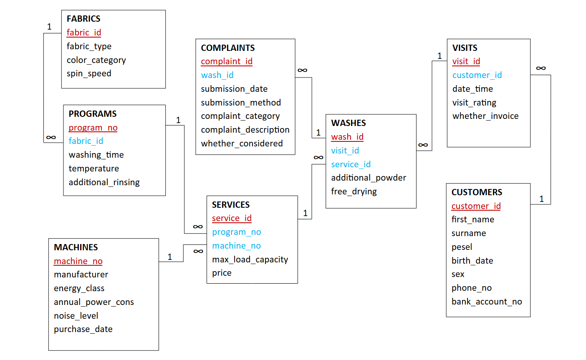

# Self-Service Laundry Database

## Database description

How does the laundry work? Each customer is registered in the database – they must provide their personal data and bank account number (payment by card only).

During one visit, the customer can do several washes, for each of them they choose one service they want to use (the Services table can be understood as a price list). The Services table is a list of possible programs for each washing machine.

Selections and payments are made using touch screens. The laundry offers – for each wash – free washing powder (of lower quality than that brought from outside or bought in the shop next to the laundry) and the possibility of free drying (pre-drying).

If the customer wants to do only part of the wash on the invoice, they must include it as a separate visit.

Each type of fabric (e.g. cotton, delicates) can be washed at several temperatures and times (relationship between the Fabrics and Programs table).

## Semantic assumptions
* One type of fabric can be washed at different temperatures and times.
* Each washing machine can have a different set of programs.
* Several complaints can be submitted for one wash (e.g. one regarding the equipment and the other regarding the price), they do not have to be submitted in the same way (by email/in person/via the website).
* One bag of free additional washing powder and free drying are provided for each wash.
* Several washes can be done during one visit (occupying several washing machines at once).
* One invoice can be taken for one visit.
* For different fabrics and temperatures the maximum permissible load for different washing machines may be different.

## Schema

The database project created on the basis of the above guidelines is presented below.

## Units

The physical units adopted for attributes are shown in the table.

| Feature                  | Unit   |
|--------------------------|--------|
| spin speed               | rpm    |
| washing time             | min    |
| temperature              | &deg;C |
| annual power consumption | kWh    |
| noise level              | dB     |
| max load capacity        | kg     |
